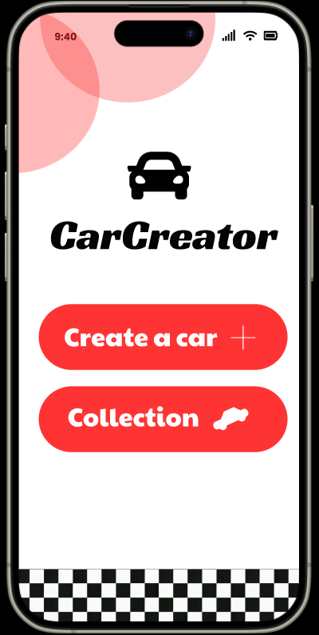
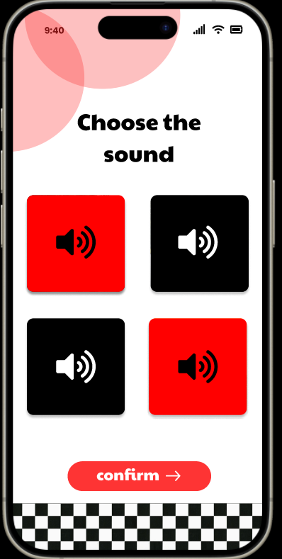
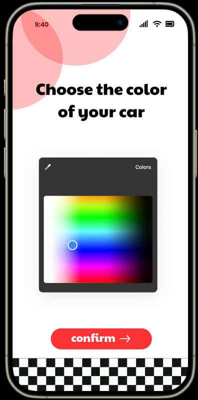
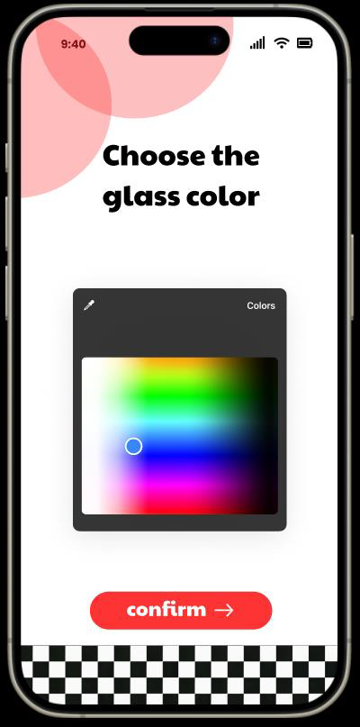
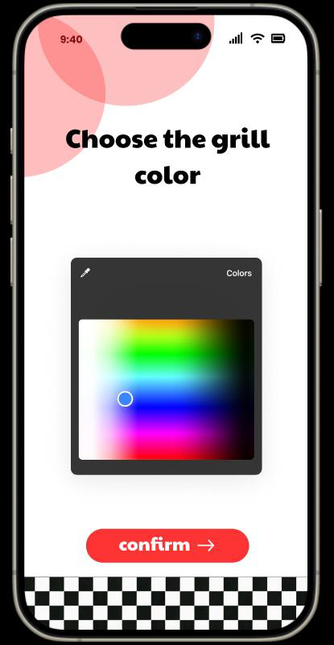
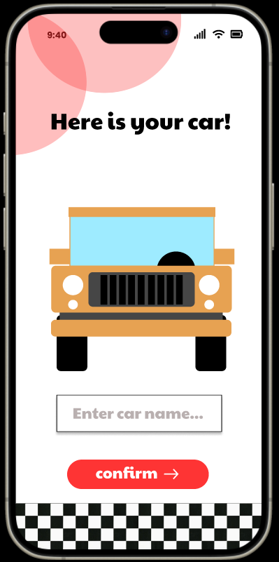
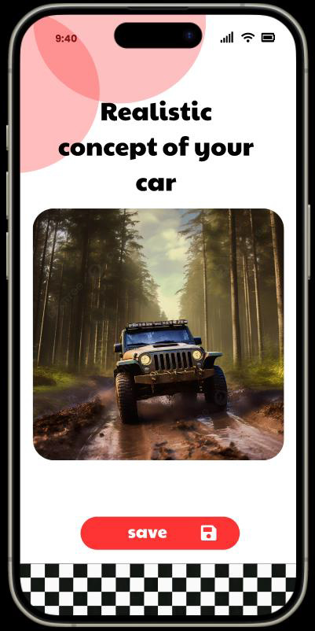
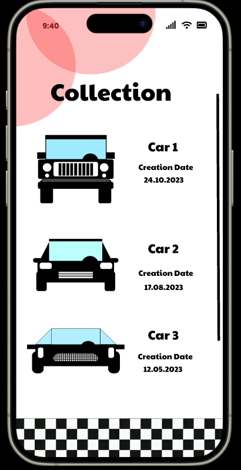
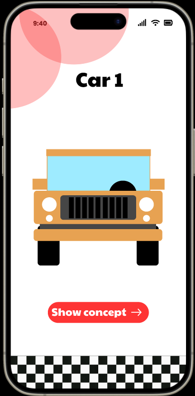
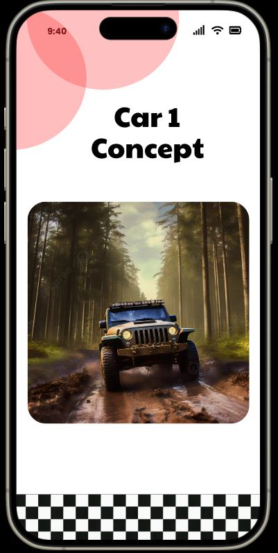

# CarCreator – Mobile App to Generate Your Dream Car

## 1. Project Goals

**CarCreator** aims to provide users with a fun and creative mobile application to design their dream cars. The project's objectives include:

- **Intuitive Design Interface** – Create a user-friendly interface that allows users to customize their dream cars effortlessly through a step-by-step process.

- **User Engagement** – Ensure the application retains user interest by providing diverse customization options and an interactive design experience.

- **AI Image Generation** – Implement AI technology to generate realistic car images based on user-selected criteria, including car type, color, grill style, and more.

- **Data Storage** – Develop a secure database solution to store user-designed cars for future reference and collection management.

- **Scalability** – Build the application with a modular architecture that allows for future enhancements, such as additional customization options and car models.

- **Data Privacy** – Ensure the protection of user data and comply with relevant data privacy regulations.

- **Accessible User Experience** – Create an intuitive and accessible app that appeals to a wide range of user demographics.

## 2. Project Description

**CarCreator** is a mobile application that enables users to design their dream cars through an interactive, step-by-step customization process. Users begin by selecting fundamental attributes such as car color, grill color, car type, and name.

The application's key feature is the integration of AI image generation technology that produces visual representations of the user's custom car based on their selections. The AI responds dynamically to user inputs, updating the preview in real-time to reflect changes accurately.

Users can save their designed cars within the app, building a personal collection for future reference. The application emphasizes design simplicity and intuitive navigation to enhance user experience and appeal to diverse user groups.

## 3. App Screens Overview

<table>
  <tr>
    <td width="33%" align="center">
      <h4 align="center">Main Screen</h4>
      
    </td>
    <td width="33%" align="center">
      <h4 align="center">Car Type Selection</h4>
      
    </td>
    <td width="33%" align="center">
      <h4 align="center">Sound Selection</h4>
      
    </td>
  </tr>
</table>

<table>
  <tr>
    <td width="33%" align="center">
      <h4 align="center">Color Selection</h4>
      
    </td>
    <td width="33%" align="center">
      <h4 align="center">Glass Color Selection</h4>
      
    </td>
    <td width="33%" align="center">
      <h4 align="center">Grill Color Selection</h4>
      
    </td>
  </tr>
</table>

<table>
  <tr>
    <td width="33%" align="center">
      <h4 align="center">Final Car Preview</h4>
      
    </td>
    <td width="33%" align="center">
      <h4 align="center">Final Car Realistic Render</h4>
      
    </td>
    <td width="33%" align="center">
      <h4 align="center">Collection Gallery</h4>
      
    </td>
  </tr>
</table>

<table align="center">
  <tr>
    <td width="50%" align="center">
      <h4 align="center">Collection Car Detail View</h4>
      
    </td>
    <td width="50%" align="center">
      <h4 align="center">Collection Car Realistic Preview</h4>
      
    </td>
  </tr>
</table>

## 4. Technologies

**Front-End Development**

- **Flutter** – A cross-platform framework for building native mobile applications with excellent performance and a rich UI component library, ideal for creating an engaging user interface.

**Back-End and Database**

- **Firebase** – Firebase offers real-time cloud database capabilities with seamless synchronization with excellent Flutter integration.

**AI Integration**

- **Stability AI API** – Leverages Stable Diffusion technology to generate high-quality, realistic car images from text prompts based on user customization choices.

**Version Control**

- **GitHub** – Industry-standard platform for version control, collaboration, and code management throughout the development lifecycle.

## 5. Setup

### Prerequisites

Before running the CarCreator app, ensure you have the following installed on your system:

- **Flutter SDK** (3.0.0 or higher) - [Install Flutter](https://docs.flutter.dev/get-started/install)
- **Dart SDK** (included with Flutter)
- **Android Studio** or **VS Code** with Flutter extensions
- **Git** - [Install Git](https://git-scm.com/downloads)

Optional:

- **Xcode** (for iOS development on macOS)
- **Android SDK** (for Android development)

### Installation

Follow these steps to set up and run the CarCreator app on your local machine:

#### 1. Clone the Repository

```bash
git clone https://github.com/urbanKR/car-creator.git
cd car-creator
```

#### 2. Install Dependencies

Run the following command to fetch all the required packages:

```bash
flutter pub get
```

#### 3. Configure Firebase

This app uses Firebase for data storage. You'll need to set up Firebase for your project:

1. Go to [Firebase Console](https://console.firebase.google.com/)
2. Create a new project or select an existing one
3. Add your Android/iOS app to the Firebase project
4. Download the configuration files:
   - **Android**: Download `google-services.json` and place it in `android/app/`
   - **iOS**: Download `GoogleService-Info.plist` and place it in `ios/Runner/`

#### 4. Configure Stability AI API

To enable AI image generation, you need a Stability AI API key:

1. Sign up at [Stability AI](https://stability.ai/)
2. Generate an API key from your dashboard
3. Create a `.env` file in the root directory (or add the key to your configuration file):

```env
STABILITY_API_KEY=your_api_key_here
```

#### 5. Verify Flutter Installation

Check if Flutter is properly installed and configured:

```bash
flutter doctor
```

Fix any issues reported by the command before proceeding.

#### 6. Run the App

##### For Android:

```bash
flutter run
```

Or specify the device:

```bash
flutter run -d
```

##### For iOS (macOS only):

```bash
flutter run -d ios
```

Or open the project in Xcode:

```bash
open ios/Runner.xcworkspace
```

Then build and run from Xcode.

##### List Available Devices:

```bash
flutter devices
```

### Building for Production

#### Android APK:

```bash
flutter build apk --release
```

The APK will be generated at: `build/app/outputs/flutter-apk/app-release.apk`

#### Android App Bundle (for Google Play):

```bash
flutter build appbundle --release
```

#### iOS (macOS only):

```bash
flutter build ios --release
```

Then archive and distribute through Xcode.

### Troubleshooting

**Issue: Dependencies not resolving**

```bash
flutter clean
flutter pub get
```

**Issue: Build fails on Android**

- Ensure you have Android SDK installed
- Check that `ANDROID_HOME` environment variable is set
- Run `flutter doctor --android-licenses` and accept all licenses

**Issue: Firebase not working**

- Verify that `google-services.json` (Android) or `GoogleService-Info.plist` (iOS) are in the correct directories
- Ensure Firebase is properly initialized in your app

**Issue: AI image generation not working**

- Verify your Stability AI API key is correctly configured
- Check your internet connection
- Ensure you have sufficient API credits

### Additional Resources

- [Flutter Documentation](https://docs.flutter.dev/)
- [Firebase for Flutter](https://firebase.flutter.dev/)
- [Stability AI API Documentation](https://platform.stability.ai/docs)
- [Dart Language Tour](https://dart.dev/guides/language/language-tour)

## 6. Project Structure

```
car-creator/
├── android/               # Android-specific code
├── ios/                   # iOS-specific code
├── lib/                   # Main Dart code
│   ├── main.dart         # App entry point
│   ├── screens/          # UI screens
│   ├── models/           # Data models
│   ├── services/         # API and Firebase services
│   └── widgets/          # Reusable widgets
├── assets/               # Images, fonts, and other assets
├── test/                 # Unit and widget tests
└── pubspec.yaml          # Project dependencies
```

## 7. Existing and Alternative Solutions

While no identical solution currently exists on the market, there are several related applications:

- **Car Customization Apps** – Various mobile apps allow users to customize aspects of car appearance (paint, wheels, decals). However, these typically lack the creative depth and AI-powered generation that CarCreator offers.

- **Manual Graphic Design Tools** – Applications like Photoshop or Canva enable custom car design through manual editing. However, these tools require significant design skills and do not incorporate AI-assisted generation, making them fundamentally different from CarCreator's approach.

**CarCreator** distinguishes itself by combining ease of use with AI-powered image generation, eliminating the need for design expertise while delivering professional-quality results.

## Summary

**CarCreator** combines user-friendly mobile design with cutting-edge AI technology to deliver a unique car customization experience. By focusing on simplicity, engagement, and visual quality, the application aims to appeal to car enthusiasts and casual users alike, providing an accessible platform for creative expression.
